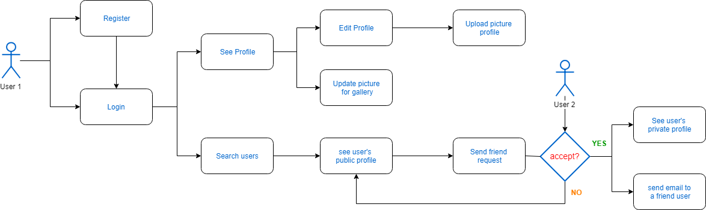

# Dogger: The First social network for your dog

          
  
## Target
Dogger is a fun application for your dog, in which you can share the life of your best friend. You can upload photos and meet other dogs, for, who knows ... maybe find some love.
 

  
 ## Functional description
This application allows you to change your profile photo, upload images to our own gallery. Send friend requests, show notifications, and if the users are friends they can see each other's photo gallery and contact email.

  
## Use case diagram

 
  
## Data Models

 
  
 ## Screenshots

 

 

 
  
 

  
 ## React Components

   
 

  
 ## Block Model

 

  
## Coverage test with Nyc-Mocha (logic Server):

  
## Technical Steps to Start App in Local

### 1º- Server side: 

Install dependencies and modules from package.json. Use command “npm install” on each of the folders:
   -server/data
   -server/logic
   -server/api

START SERVER on localhost from server/api. Command: nodemon .

### 2º- Client side:

Install dependencies and modules from package.json. Use command “npm install” on each of the folders:
   -client/api
   -client/app (React)

START REACT APP on browser from client/app. Command: npm start
  